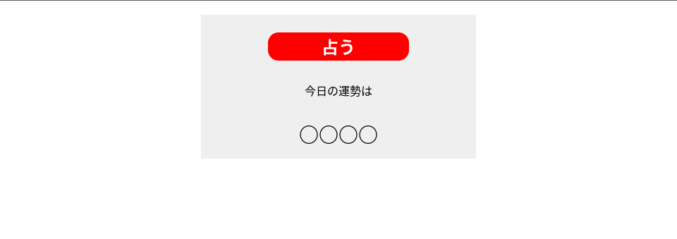

# 【ひらくのプログラミング教室】javascript実践編

こちらは[【ひらくのプログラミング教室】javascript実践編](https://www.youtube.com/playlist?list=PLHPBV1ZN8yuKzyIa_hZFszrnXDPdn3Ey1)でひらく先生に教えていただいた練習プログラムのレポジトリーです。今回の目標はVanillaJSに挑戦しながらCSSやHTMLの基礎的知識に自信が持てるようになりたいと思います。

## 目次

- [概要](#概要)
  - [挑戦する問題](#挑戦する問題)
  - [スクリーンショット](#スクリーンショット)
- [過程](#過程)
  - [使われたフレームワーク](#フレームワーク)
  - [これからの進捗](#進捗)
  - [役に立ったリソース](#リソース)
- [開発者](#開発者)

## 概要

### 挑戦する問題

【ひらくのプログラミング教室】javascript実践編のプログラムに挑戦してみること。プログラムリストの一覧はこちらです。
- [初心者向け占いゲームを作ってみよう](https://youtu.be/zPEIBxUI9jI?si=_3PkfgR10jrpVZxR)
- [初心者向けjavascriptでおみくじアプリ作成](https://youtu.be/xwCBjlFTjn8?si=y9eokl94MPQeooro)
- [自動更新カレンダーを作成してみよう](https://youtu.be/lCPW9h3vNng?si=eD0fyMKA8KU3rpu_)
- [ハンバーガーメニューを作ってみよう](https://youtu.be/mKxLNJE4qj0?si=YikDfkDD2sFuNSN_)
- [モーダルウィンドウを作ってみよう](https://youtu.be/6JF0UAX7g-k?si=XInw_uHs4-GU16tu)
- [カウントダウンタイマーを作ってみよう](https://youtu.be/dtxlQ-ywd0g?si=8A1BXcqORwV8bUrb)
- [画像をクリックで切り替えるサムネイル](https://youtu.be/Ll7yZA9VULU?si=yisGSut2ifp0eN88)
- [シンプルなスライダー(カルーセル)を作ってみよう](https://youtu.be/_dZgAzvKdS4?si=3YznSsc_uabCH6yu)
- [javascriptでクイズアプリを作成してみよう](https://youtu.be/E5Ly3SKZj24?si=QHaau_TmqIECy_aK)

### スクリーンショット

## 過程

### フレームワーク

- HTML5 マークアップ言語
- CSS
- Vanilla javascript
- [ブートストラップ](https://getbootstrap.com/docs/4.0/getting-started/introduction/)

### 進捗

2年生のとき、AsiaToJapanラボ（株）で6ヶ月間のインターンシップができ、チームメイトとメンターのおかげで、ウエブ開発の分野に触れ合えるようになりました。RubyonRailsフレームワークの基礎的知識も得れるようになりました。

機械工学部ロボット専攻の学生として、機械製造・機械設計の分野で働いている人々は基本的にウエブ開発の分野で使われているフレームワークやテクノロジーについてあまり知識を持っていないかもしれないと思います。だからこそ、これから色んなプロジェクトをやってみて、フロントエンドと共にバックエンドの知識も得れるように頑張っていきたいと思っております。将来、オートメーション・エンジニアとしてお客様に喜んでいただけるように自動操作と共に素敵なウエブアプリケーションも作っていきたいと思います。

こちらのウエブアプリケーションの操作について何か改良点とかありましたら、ご遠慮なくご連絡ください！
それと、これからのプロジェクトもよろしくお願いいたします！！

### リソース

- [ブートストラップ・ドキュメンテーション](https://getbootstrap.com/docs/4.0/getting-started/introduction/) - ウエブアプリケーションのデザインを作るにはすごく役に立っているリソースの一つ. ブートストラップのフレームワークがすごく好きで、これからのウエブ開発にも使っていこうと思っております.
- [JavaScript入門・完全コース/プログラミング初心者向け、コスパ最強講座](https://youtu.be/ig3GosWuKF0?si=pplRLyK36QEBnm3l) - こちらのYoutubeチャンネルはすごくわかりやすいし、やっとVanilla JSの基礎的知識が得れるようになった気がします。レスポンシブデザインの基礎的知識も身につけることができたと思います。
- [RailAssetHelpersでimage_tagの使い方](https://api.rubyonrails.org/classes/ActionView/Helpers/AssetTagHelper.html#method-i-image_tag) - image_tagsとfavicon_tagsに関する悩みを解決するにはすごく役に立ってきたRailsのドキュメンテーションの一つ.

## 開発者

- レポジトリー - [Manas Anjalekar | アンジャレカル・マナス](https://github.com/Manas-Anjalekar/hiraku_programming_kyoushitsu_javascript_jissenhen)
- Linkedin - [@Manas-Anjalekar](https://linkedin.com/in/manas-anjalekar)
